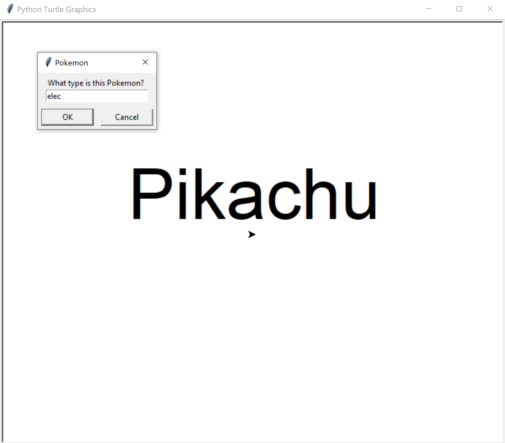

# <div align = "center"> Turtle Flashcards
In this tutorial, we will be creating Pokemon flashcards using Turtle in Python 3. In this game you will be given the name of a Pokemon and will be asked what type it is.

**Difficulty** (out of 5): 🌶

**This Tutorial Includes:**
* Dictionaries / Maps



---
# Step 1: Mapping out Pokemon

To start with, we're going to start of by creating a list like this:

``` python
pokemon = [ ]
```

Now let's make a dictionary / map inside this list, so that the name of a Pokemon corresponds with it's type, for example Pikachu, an electric type:

``` python
pokemon = [
    {"name": "Pikachu", "type": "electric"}
    ]
```

Let's now fill this list with more single type pokemon, for example (Don't forget to put commas inbetween the items of the list!):

``` python
pokemon = [
    {"name":"Pikachu", "type": "electric"},
    {"name":"Squirtle", "type": "water"},
    {"name":"Charmander", "type": "fire"},
    {"name":"Geodude", "type": "rock"},
    {"name":"Caterpie", "type": "bug"},
    {"name":"Rattata", "type": "normal"},
   ]
```

---
# Step 2: Turtle use Write!

Next up, we need to `import turtle` and random into python, which we will be using for this step. Before your list, type:

``` python
import turtle
import random

pokemon = [
    {"name":"Pikachu", "type": "electric"},
    {"name":"Squirtle", "type": "water"},
    {"name":"Charmander", "type": "fire"},
    {"name":"Geodude", "type": "rock"},
    {"name":"Caterpie", "type": "bug"},
    {"name":"Rattata", "type": "normal"},
   ]
```
Now lets test out our new random tool! Let's get our code to pick a random item of our list `pokemon` and print whatever item came out. Let's make this random item a variable as well, so that we can use it later:

``` python
import turtle
import random

pokemon = [
    {"name":"Pikachu", "type": "electric"},
    {"name":"Squirtle", "type": "water"},
    {"name":"Charmander", "type": "fire"},
    {"name":"Geodude", "type": "rock"},
    {"name":"Caterpie", "type": "bug"},
    {"name":"Rattata", "type": "normal"},
   ]

item = random.choice(pokemon)
print(item)
```

Test this! In your terminal you should get a random item from the list printed out! Nice! Continuing, let's start working on the turtle! Remove the `print(item)` line. Let's get the turtle to write the peramiter `"name"` of the dictionary in the variable `item`.

``` python
item = random.choice(pokemon)

turtle.write(
    item["name"],
    align = "center",
    font = ("Arial", 80, "normal")
    )
```

Test this! A Turtle window should open with the name of a random Pokemon from the list `pokemon`, however it should quickly close after. In `turtle.write`, it has the argument, the alignment (Make sure to spell centre the American way, center) and the font, EG: the fontname, fontsize and fonttype.

---
# Step 3: Pokewizing this Pokequiz

Now we're going start making our game. Currently our project just writes a random Pokemon in a Turtle window. So lets get a game rolling!

``` python
turtle.write(
    item["name"],
    align = "center",
    font = ("Arial", 80, "normal")
    )

ans = turtle.textinput("Pokemon", "What type is this Pokemon? ")
```

So, we've put a request for input inside the Turtle window inside of the variable `ans`. Inside of the brackets in this function, there is first a title, `"Pokemon"`, and the request, `"What type is this pokemon? "`. Test this! This is looking a lot more like a game! Only now, we need to identify whether the answer is correct or not:

``` python
ans = turtle.textinput("Pokemon", "What type is this Pokemon? ")

if ans == item["type"]:
    turtle.pencolor("green")
else:
    turtle.pencolor("red")
```

Test this! The outline of your turtle should turn either green or red if you got it right or wrong. Make sure to spell colour the American way (color)! Now let's make the turtle show the correct answer:

``` python
if ans == item["type"]:
    turtle.pencolor("green")
else:
    turtle.pencolor("red")

turtle.setheading(-90)
turtle.forward(100)

turtle.write(
    item["type"],
    align = "center",
    font = ("Arial", 80, "normal")
    )
```

Test this! Once you input your answer, the turtle should move down and write the type of the random Pokemon, then close. However, it's left an untidy line. Let's quickly remove that:

``` python
turtle.penup()

ans = turtle.textinput("Pokemon", "What type is this Pokemon? ")

if ans == item["type"]:
    turtle.pencolor("green")
else:
    turtle.pencolor("red")
```

Test this! This should work now!

---
# Step 4: Loop Lagoon

Now we're gonna need to `import time`.

``` python
import turtle
import random
import time

pokemon = [
    {"name":"Pikachu", "type": "electric"},
    {"name":"Squirtle", "type": "water"},
    {"name":"Charmander", "type": "fire"},
    {"name":"Geodude", "type": "rock"},
    {"name":"Caterpie", "type": "bug"},
    {"name":"Rattata", "type": "normal"},
   ]
```

Next, let's add this piece of code, preparing to add a loop:

``` python
turtle.setheading(-90)
turtle.forward(100)

turtle.write(
    item["type"],
    align = "center",
    font = ("Arial", 80, "normal")
    )
time.sleep(3)
turtle.clear()
turtle.goto(0,0)
turtle.color("black")
```

Don't forget to spell colour the American way! You can test this, but it won't be very useful. Now to finally add the loop:

``` python
while True:
    item = random.choice(pokemon)

    turtle.write(
        item["name"],
        align = "center",
        font = ("Arial", 80, "normal")
        )
        
    ans = turtle.textinput("Pokemon", "What type is this Pokemon? ")

    if ans == item["type"]:
        turtle.pencolor("green")
    else:
        turtle.pencolor("red")

    turtle.setheading(-90)
    turtle.forward(100)

    turtle.write(
        item["type"],
        align = "center",
        font = ("Arial", 80, "normal")
        )
    time.sleep(3)
    turtle.clear()
    turtle.goto(0, 0)
    turtle.color("black")
```

Well done, you now have your own Poke-flashcards!
### WAIT, WAIT UP! Before you go and get another tutorial up, try:
# <div align = "center"> 🎉 PERSONALISING 🎉
* Add of change up the Pokemon in the list!
* Try making a Pokemon with multiple types!
* Try drawing an image of a Pokemon.
* Change the background colour.

Or anything else, make this project your own!

## <div align = "center"> Go Make Stuff and be Awesome!
